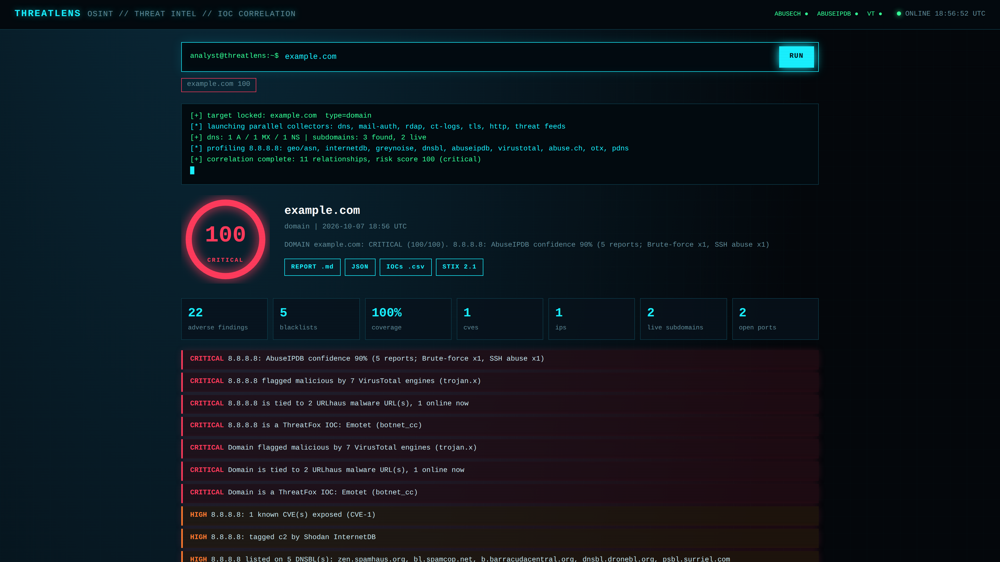
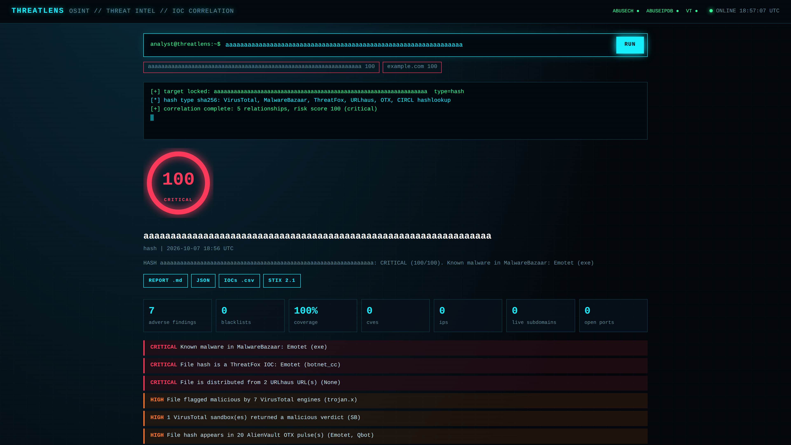
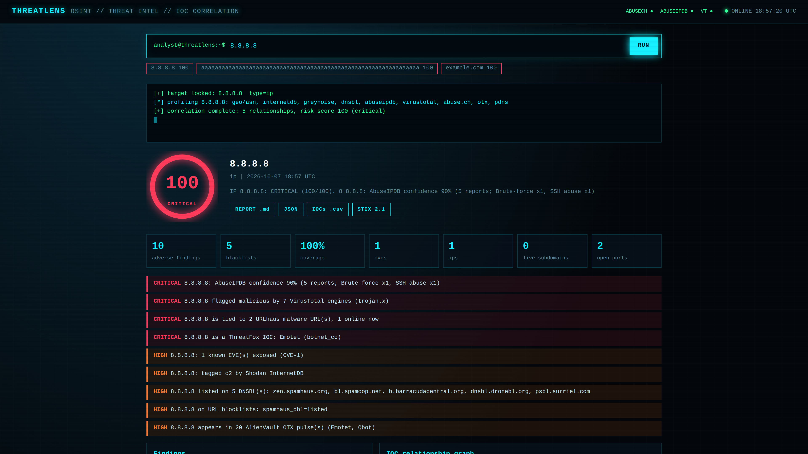
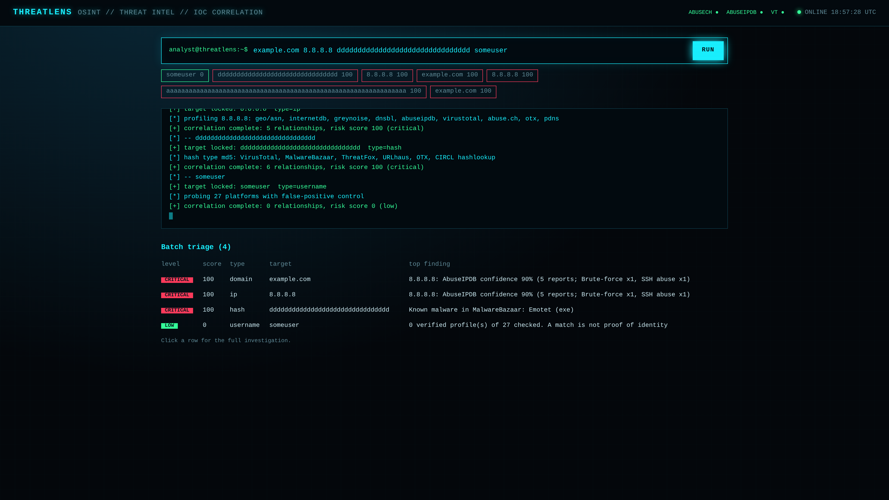

# ThreatLens

**Passive OSINT & threat-intelligence correlation platform.** Give it a domain, IP, URL, e-mail, file hash or username and it collects public intelligence, correlates the indicators into a graph, and returns a 0-100 risk score with evidence.



> Screenshots use **mocked demo data** (every API was simulated), so scores and findings are illustrative only.

## Features
- **Six target types:** domain, IP, URL, e-mail, file hash (MD5/SHA-1/SHA-256), username. Paste several at once for a batch triage table.
- **Threat feeds:** VirusTotal, AbuseIPDB, URLhaus, MalwareBazaar, ThreatFox, AlienVault OTX, GreyNoise, Shodan InternetDB, CIRCL hashlookup, DNSBLs.
- **Domain analysis:** RDAP age, DNS, SPF/DKIM/DMARC/MTA-STS, TLS, HTTP security headers, certificate-transparency subdomains, dangling-CNAME takeover detection, typosquat / homoglyph / punycode / DGA look-alike detection.
- **IOC graph:** interactive relationship graph; double-click a node to pivot.
- **Honest output:** every source shows its status (ok / no data / no key / auth failed / rate limited / unreachable) plus an overall coverage %.
- **Exports:** Markdown report, JSON, IOC CSV, STIX 2.1 bundle.
- **Safe by design:** SSRF guard (private/loopback hosts are never probed), CSP and security headers, scan throttling, API keys never reach the browser.

| Malware hash | IP profile | Batch triage |
|---|---|---|
|  |  |  |

## Quick start
```bash
git clone https://github.com/<your-username>/threatlens.git
cd threatlens
pip install -r requirements.txt
cp .env.example .env      # then add your keys
python app.py             # http://127.0.0.1:5000
```

## API keys (all optional)
| Variable | Service | Unlocks |
|---|---|---|
| `VT_API_KEY` | VirusTotal | reputation, sandbox verdicts, passive DNS, contacted domains/IPs |
| `ABUSEIPDB_KEY` | AbuseIPDB | IP abuse score and attack categories |
| `ABUSECH_KEY` | abuse.ch | URLhaus, MalwareBazaar, ThreatFox |

Without keys the tool still works using free sources. Tuning: `VT_RPM` (default 4 = free tier), `CACHE_TTL`, `HOST`, `PORT`.

## Limitations
No tool is 100% accurate. Username matches are not proof of identity, shared-hosting IPs can inherit someone else's blacklist entries, and a clean result means "nothing found in these sources", not "safe". Treat the score as a triage guide.

## Legal
Use only on targets you are authorised to investigate. Collection is passive/public; the only direct contact with a target is a normal HTTPS request and TLS handshake. Provided as-is under the MIT license.
